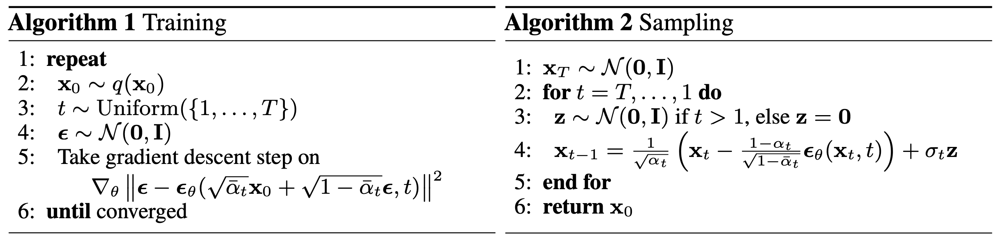

# Denoising Diffusion Probabilistic Models

[Denoising Diffusion Probabilistic Models (DDPM)](https://arxiv.org/abs/2006.11239), published in December 2020, build upon the earlier work [*Deep Unsupervised Learning using Nonequilibrium Thermodynamics*](https://arxiv.org/abs/1503.03585) (2015). At the time of the earlier paper, generative modeling was dominated by GANs, so diffusion models received relatively little attention. DDPM revived the idea by showing that data can be generated by reversing a gradual noising process, and that training reduces to a remarkably simple noise-prediction objective. Despite this simplicity, DDPMs achieve high-quality and diverse image generation, rivaling GANs while offering greater stability and a likelihood-based formulation.


**1D Example**
We consider a simple toy problem where the data comes from a 1D Gaussian Mixture Model (GMM) with two modes, centered at -2 and +2. Each data point is just a single scalar sampled from one of the two Gaussians. The goal of the diffusion model is to learn this bimodal distribution: starting from pure Gaussian noise, the model should gradually denoise and recover samples that follow the original two-peaked structure.


## TL;DR

DDPM reframes maximum likelihood training of generative models into a simple regression task. By adding noise step by step and learning to predict it back out, the model reduces a complex likelihood objective into a straightforward MSE loss on noise prediction.


```math
\text{Goal:}\quad \max_\theta \; \log p_\theta(x_0)
```

```math
\text{Optimization objective:} \quad \min_\theta \; 
\mathbb{E}_{t, x_0, \varepsilon}
\Big[
  \|\varepsilon - \varepsilon_\theta(x_t, t)\|^2
\Big]
```


## Training Algorithm



## Derivation 

### Step 1 Negative Log-Likelihood

The high-level goal of DDPM is to **train a generative model** that can sample from the true data distribution. To do this, we maximize the likelihood of data $x_0$ under our model $p_\theta(x_0)$.  Equivalently, we minimize the **negative log-likelihood (NLL):**

For a data sample $x_0$, the negative log-likelihood (NLL) is:

```math
\text{NLL}(x_0; \theta) = -\log p_\theta(x_0).
```

Since the model uses latent noised states $x_{1:T}$, the marginal likelihood is:

```math
p_\theta(x_0) = \int p_\theta(x_0, x_{1:T}) \, dx_{1:T}
= \int \Big[ p(x_T) \prod_{t=1}^{T} p_\theta(x_{t-1} \mid x_t) \Big] dx_{1:T}.
```

This integral is intractable, so we will use a variational bound (ELBO) in the next step.

### Step 2: Evidence Lower Bound (ELBO)

Directly computing the marginal likelihood $p_\theta(x_0)$ is intractable, since it requires integrating over all latent variables $x_{1:T}$. To address this, we introduce the forward noising process $q(x_{1:T} \mid x_0)$ as a **variational distribution** and apply Jensen's inequality

```math
\log p_\theta(x_0) 
= \log \int p_\theta(x_0, x_{1:T}) \, dx_{1:T}
= \log \mathbb{E}_{q(x_{1:T} \mid x_0)} 
\Bigg[ \frac{p_\theta(x_0, x_{1:T})}{q(x_{1:T} \mid x_0)} \Bigg]
\geq 
\mathbb{E}_{q(x_{1:T} \mid x_0)} 
\Bigg[ \log \frac{p_\theta(x_0, x_{1:T})}{q(x_{1:T} \mid x_0)} \Bigg].
```

This inequality comes from **Jensen's inequality** and gives us a tractable lower bound on $\log p_{\theta}(x_0)$. 


### Step 3: ELBO Decomposition

The ELBO is:

```math
\mathbb{E}_{q(x_{1:T}\mid x_0)}
\left[
  \log \frac{p_\theta(x_0, x_{1:T})}{q(x_{1:T}\mid x_0)}
\right].
```

Using the factorizations

```math
p_\theta(x_0, x_{1:T}) = p(x_T)\prod_{t=1}^T p_\theta(x_{t-1}\mid x_t),
\quad
q(x_{1:T}\mid x_0) = \prod_{t=1}^T q(x_t\mid x_{t-1}),
```

we can rewrite:

```math
\mathcal{L}_\text{ELBO} =
\mathbb{E}_q\Big[
  \log p(x_T)
  + \sum_{t=1}^T \log p_\theta(x_{t-1}\mid x_t)
  - \sum_{t=1}^T \log q(x_t\mid x_{t-1})
\Big].
```

This further decomposes into three interpretable terms:

```math
\mathcal{L}_\text{ELBO} =
\mathbb{E}_q\!\left[ D_\text{KL}\!\big(q(x_T\mid x_0)\,\|\,p(x_T)\big) \right]
+ \sum_{t=2}^T \mathbb{E}_q\!\left[
  D_\text{KL}\!\big(q(x_{t-1}\mid x_t, x_0)\,\|\,p_\theta(x_{t-1}\mid x_t)\big)
\right]
- \mathbb{E}_q\!\left[\log p_\theta(x_0\mid x_1)\right].
```

**Interpretation**

* **Prior term:** matches the terminal noised state $x_T$ to the prior $p(x_T)$. Doesn't depend on $\theta$.
* **Denoising terms:** fit each learned reverse transition to the true posterior.
* **Reconstruction term:** likelihood of recovering $x_0$ from $x_1$ (very small).

Hence, in practice, we only optimize a **Simplified ELBO**, which only has the denoising terms:

```math 
\mathcal{L}_\text{ELBO} \approx
\mathcal{L}_\text{simple ELBO} =
 \sum_{t=2}^T \mathbb{E}_q\!\left[
  D_\text{KL}\!\big(q(x_{t-1}\mid x_t, x_0)\,\|\,p_\theta(x_{t-1}\mid x_t)\big)
\right]
```


### Step 4: Use Gaussian 

Starting from the ELBO decomposition (prior term, sum of KLs, reconstruction), the key move is to note that the **denoising terms** compare two **Gaussians** at each step:

* True posterior: $q(x_{t-1}\mid x_t, x_0)=\mathcal{N}(\tilde\mu_t(x_t,x_0),\,\tilde\beta_t I)$
* Model reverse step: $p_\theta(x_{t-1}\mid x_t)=\mathcal{N}(\mu_\theta(x_t,t),\,\sigma_t^2 I)$

With fixed variance $\sigma_t^2$ (e.g., $\sigma_t^2=\beta_t$ or $\sigma_t^2=\tilde\beta_t$), the **KL between Gaussians** reduces to a constant plus a **squared error between the means**:

```math
\mathbb{E}_q\!\left[
D_{\mathrm{KL}}\Big(q(x_{t-1}\mid x_t,x_0)\,\|\,p_\theta(x_{t-1}\mid x_t)\Big)
\right]
=
\text{const}
+
\frac{1}{2\sigma_t^2}\,
\mathbb{E}_q\!\left[
\big\|\tilde\mu_t(x_t,x_0) - \mu_\theta(x_t,t)\big\|^2
\right].
```

Next, use the **one-shot forward reparameterization**

```math
x_t \;=\; \sqrt{\bar\alpha_t}\,x_0 \;+\; \sqrt{1-\bar\alpha_t}\,\varepsilon,
\qquad \varepsilon\sim\mathcal{N}(0,I),
```

which lets us rewrite the **true posterior mean** in terms of the actual noise $\varepsilon$:

```math
\tilde\mu_t(x_t,x_0)
=
\frac{1}{\sqrt{\alpha_t}}
\left(
x_t
-
\frac{\beta_t}{\sqrt{1-\bar\alpha_t}}
\,\varepsilon
\right).
```

Parameterize the model mean via a **noise-prediction network** $\varepsilon_\theta(x_t,t)$:

```math
\mu_\theta(x_t,t)
=
\frac{1}{\sqrt{\alpha_t}}
\left(
x_t
-
\frac{\beta_t}{\sqrt{1-\bar\alpha_t}}
\,\varepsilon_\theta(x_t,t)
\right).
```

Plugging these into the KL term yields a **weighted MSE in noise space**:

```math
\mathbb{E}_{x_0,\varepsilon,t}
\left[
\lambda_t\,\big\|\varepsilon - \varepsilon_\theta(x_t,t)\big\|^2
\right]
+\text{const},
\qquad
\lambda_t
=
\frac{\beta_t^2}{2\,\sigma_t^2\,\alpha_t\,(1-\bar\alpha_t)}.
```

Putting it all together:

* The **prior** and **reconstruction** pieces are constant or straightforward given fixed choices.
* The **sum of KLs** collapses to a (weighted) noise-prediction MSE.

In practice, DDPM uses a **simplified objective** by **dropping $\lambda_t$** and **sampling $t$ uniformly**:

```math
\mathcal{L}_{\text{simple}}(\theta)
=
\mathbb{E}_{t, x_0, \varepsilon}
\Big[
\big\|\varepsilon - \varepsilon_\theta(x_t,t)\big\|^2
\Big].
```


---

### Symbols

- **$x_0$**: Clean data sample (e.g., image).
- **$x_t$**: Noisy latent at step $t$, with $x_T$ ~ pure noise.
- **$T$**: Number of diffusion steps.
- **$q(x_0)$**: True data distribution.
- **$q(x_{1:T} \mid x_0)$**: Complete forward/noising process (fixed).
- **$p_\theta(x_0)$**: Model’s marginal likelihood of data.
- **$p_\theta(x_0, x_{1:T})$**: Model’s joint distribution.
- **$p(x_T)$**: Prior at final step (Gaussian).
- **$p_\theta(x_{t-1} \mid x_t)$**: Complete reverse/denoising step, learned by NN.
- **$\theta$**: Trainable parameters of the network.
- **$\beta_t, \alpha_t, \bar\alpha_t$**: Noise schedule parameters.
- **$\varepsilon, z$**: Standard Gaussian noise.

