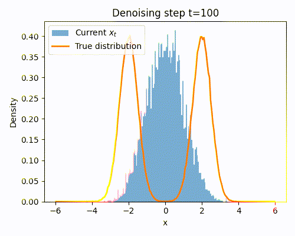
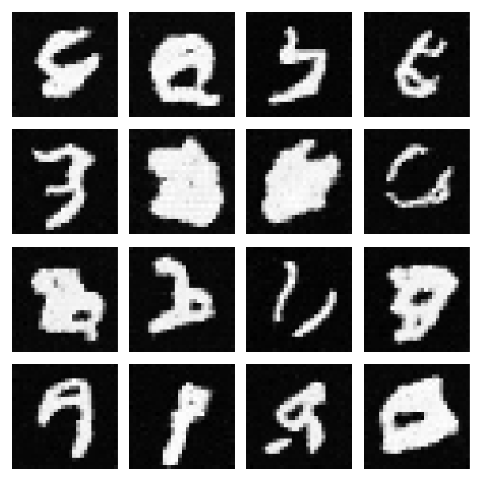

# Score-Based Generative Modeling through SDEs

[Score-Based Generative Modeling through Stochastic Differential Equations (Song et al., 2021)](https://arxiv.org/abs/2011.13456) generalizes diffusion models to the continuous-time domain. Instead of a discrete forward noising chain (DDPM), it defines a stochastic differential equation (SDE) that gradually perturbs data into noise. By learning the **score function** (the gradient of the log-density) at each noise level, we can simulate the reverse-time SDE to generate new samples. This framework unifies score matching, diffusion models, and stochastic processes.

**TL;DR**

Score-based generative modeling reframes learning as **estimating the score** of noisy data distributions across continuous noise scales.
Training is done via **denoising score matching (DSM)**, and sampling corresponds to simulating the **reverse SDE** (stochastic) or the **probability-flow ODE** (deterministic).

```math
\text{Goal:}\quad \max_\theta \; \log p_\theta(x_0)
```


```math
\text{Training objective:}\quad 
\min_\theta\;
\mathbb{E}_{t,x_0,x_t}
\left[
  \lambda(t)\,\big\|\, s_\theta(x_t,t) - \nabla_x \log q(x_t\mid x_0) \big\|^2
\right]
```


## Training Algorithm

* Sample data point $x_0 \sim q_\text{data}$
* Sample random time $t \sim \mathcal U[0,1]$
* Add Gaussian noise using the forward SDE: $x_t \sim q(x_t \mid x_0)$
* Compute analytic conditional score: $-\tfrac{x_t-\mu_t(x_0)}{\sigma_t^2(t)}$
* Train network $s_\theta(x_t, t)$ to match it with MSE


## 1D Example

We consider a simple toy problem where the data comes from a 1D Gaussian Mixture Model (GMM) with two modes, centered at -2 and +2. Each data point is just a single scalar sampled from one of the two Gaussians. The goal of the diffusion model is to learn this bimodal distribution: starting from pure Gaussian noise, the model should gradually denoise and recover samples that follow the original two-peaked structure.



## 2D Example

## 2D Example
In this example, we are going to learn to generate images that looks like the MNIST dataset.



## Setup & Goal

```math
\text{Data: } x_0 \sim q_{\text{data}}(x). \\
\text{Define noisy marginals } q_t(x) \text{ for } t\in[0,1]. \\
\textbf{Goal: learn the score } s_\theta(x,t)\approx \nabla_x \log q_t(x).
```

## Step 1 — Forward (noising) SDEs and their Gaussians

We corrupt data via an Itô SDE

```math
dx = f(x,t)\,dt + g(t)\,dW_t, \qquad x(0)\sim q_{\text{data}}.
```

Two standard choices give **Gaussian** perturbations $q(x_t\mid x_0)$:

**(a) VE (Variance Exploding) SDE**

```math
dx = \sqrt{\frac{d\,\sigma^2(t)}{dt}}\, dW_t
\;\;\Longrightarrow\;\;
x_t = x_0 + \sigma(t)\,\varepsilon,\ \ \varepsilon\sim \mathcal N(0,I).
```

**(b) VP (Variance Preserving) SDE** (Ornstein–Uhlenbeck)

```math
dx = -\tfrac{1}{2}\beta(t)\,x\,dt + \sqrt{\beta(t)}\, dW_t
\;\;\Longrightarrow\;\;
x_t \sim \mathcal N\!\left(\sqrt{\bar\alpha(t)}\,x_0,\ (1-\bar\alpha(t))I\right),
\quad \bar\alpha(t)=e^{-\int_0^t \beta(u)\,du}.
```

Thus, for both VE/VP we have a closed-form conditional

```math
q(x_t\mid x_0) = \mathcal N\!\big(\mu_t(x_0),\,\sigma_t^2(t) I\big).
```


## Step 2 — Reverse-time SDE (Anderson ’82)

Let $q_t$ be the density of $x_t$. Time reversal of the forward SDE yields a **reverse SDE** whose drift depends on the (unknown) score $\nabla_x \log q_t(x)$:

```math
dx = \Big[f(x,t) - g(t)^2\,\nabla_x \log q_t(x)\Big]\,dt \;+\; g(t)\, d\bar W_t,
\qquad \text{integrated from } t=1 \to 0.
```

If we learn $s_\theta(x,t)\approx \nabla_x \log q_t(x)$, we can simulate this reverse SDE to generate samples.


## Step 3 — Key identity (marginal score via conditional score)

Because $q_t(x)=\int q(x\mid x_0)\,q_{\text{data}}(x_0)\,dx_0$ with Gaussian $q(x\mid x_0)$,

```math
\nabla_x \log q_t(x) \;=\; \mathbb{E}\big[\,\nabla_x \log q(x\mid x_0)\ \big|\ x_t=x\,\big].
```

*Sketch:* Differentiate under the integral and divide by $q_t(x)$:

$$
\nabla_x q_t(x) = \int \nabla_x q(x\mid x_0) q_{\text{data}}(x_0) dx_0
= q_t(x)\,\mathbb{E}[\,\nabla_x \log q(x\mid x_0)\mid x_t=x\,].
$$

This lets us learn the marginal score by matching the **known** conditional score of the Gaussian perturbation.


## Step 4 — Denoising Score Matching (continuous-time DSM)

Sample $t\sim\mathcal U[0,1]$, $x_0\sim q_{\text{data}}$, then $x_t\sim q(\cdot\mid x_0)$. Minimize

```math
\min_\theta\;
\mathbb{E}_{t,x_0,x_t}\!
\left[
\lambda(t)\,\big\|\, s_\theta(x_t,t) - \nabla_x \log q(x_t\mid x_0) \big\|^2
\right],
```

with a weighting $\lambda(t)>0$ (picked for numerical balance; see Step 5).

For Gaussian $q(x_t\mid x_0)=\mathcal N(\mu_t,\sigma_t^2 I)$,

```math
\nabla_x \log q(x_t\mid x_0) \;=\; -\frac{x_t-\mu_t(x_0)}{\sigma_t^2(t)}.
```

* **VE:** $x_t=x_0+\sigma(t)\varepsilon \Rightarrow \nabla_x \log q = -\varepsilon/\sigma(t)$.
* **VP:** $x_t=\sqrt{\bar\alpha}\,x_0+\sqrt{1-\bar\alpha}\,\varepsilon
  \Rightarrow \nabla_x \log q = -\varepsilon/\sqrt{1-\bar\alpha(t)}$.

By the identity in Step 3, the minimizer satisfies $s_\theta(x,t)=\nabla_x\log q_t(x)$.


## Step 5 — Practical parameterizations & weights

Two equivalent heads (pick one):

**(a) Score head**

```math
\mathcal L = \mathbb{E}\!\left[\lambda(t)\ \big\|\, s_\theta(x_t,t) + \tfrac{x_t-\mu_t(x_0)}{\sigma_t^2(t)} \big\|^2\right].
```

**(b) Noise head** (predict $\varepsilon_\theta$ and convert to a score)

```math
s_\theta(x_t,t) = -\frac{1}{\sigma_t(t)}\,\varepsilon_\theta(x_t,t)
\;\;\Longrightarrow\;\;
\mathcal L = \mathbb{E}\!\left[\lambda(t)\ \big\|\, \varepsilon - \varepsilon_\theta(x_t,t) \big\|^2\right].
```

Typical **$\lambda(t)$** choices:

* VE: $\lambda(t)=\sigma(t)^2$ (balances small/large noise scales).
* VP: $\lambda(t)=1$ or $\lambda(t)=1-\bar\alpha(t)$.


## Step 6 — Samplers

### (A) Reverse SDE (stochastic)

Discretize $t$ from 1→0 (e.g., Euler–Maruyama). One step with step size $\Delta t<0$:

```math
x \leftarrow x + \Big[f(x,t) - g(t)^2 s_\theta(x,t)\Big]\Delta t \;+\; g(t)\sqrt{|\Delta t|}\, z,\quad z\sim\mathcal N(0,I).
```

**Predictor–Corrector (PC)**: after the predictor step above, do a few **Langevin corrections**

```math
x \leftarrow x + \eta\, s_\theta(x,t) + \sqrt{2\eta}\, z,
```

where $\eta$ is tuned to maintain a target SNR at each $t$. PC significantly improves sample quality.

### (B) Probability-flow ODE (deterministic; DDIM-like)

There exists an ODE with the **same marginals** $q_t$:

```math
\frac{dx}{dt} = f(x,t) - \tfrac{1}{2} g(t)^2\, s_\theta(x,t).
```

Integrating this ODE from $t=1$ (Gaussian prior) to $t=0$ yields deterministic samples (often faster/cleaner; enables exact likelihood below).


## Step 7 — Exact likelihood via the probability-flow ODE

By the instantaneous change-of-variables formula, along the ODE trajectory $x_t$:

```math
\frac{d}{dt}\log q_t(x_t) \;=\; -\,\nabla_x\!\cdot\!\Big(f(x_t,t) - \tfrac{1}{2} g(t)^2\, s_\theta(x_t,t)\Big).
```

Integrate from $t=1\to 0$:

```math
\log q_0(x_0) = \log q_1(x_1)
\;-\;
\int_{1}^{0}
\nabla_x\!\cdot\!\Big(f(x_t,t) - \tfrac{1}{2} g(t)^2\, s_\theta(x_t,t)\Big)\, dt.
```

* $q_1$ is typically **Gaussian**, so $\log q_1(x_1)$ is known.
* The divergence term is a **trace of a Jacobian**; estimate it efficiently with **Hutchinson’s trick**:

```math
\nabla_x\!\cdot F(x) \;=\; \mathbb{E}_{v\sim\mathcal N(0,I)}\,[\, v^\top J_F(x)\, v \,].
```

This yields **exact likelihoods** for score-based models via one ODE solve.


## Step 8 — Mapping VP SDE ↔ DDPM

For VP SDE with $\bar\alpha(t)=e^{-\int_0^t \beta}$, discretize time to $t_k$ and get

```math
x_{t_k} = \sqrt{\bar\alpha_k}\, x_0 + \sqrt{1-\bar\alpha_k}\,\varepsilon,
```

which is exactly the **DDPM forward**. The DSM target becomes

```math
\nabla_x \log q(x_{t_k}\mid x_0) = -\frac{\varepsilon}{\sqrt{1-\bar\alpha_k}},
```

so **predicting $\varepsilon$** (DDPM) is just predicting the **score** up to a known scale.
